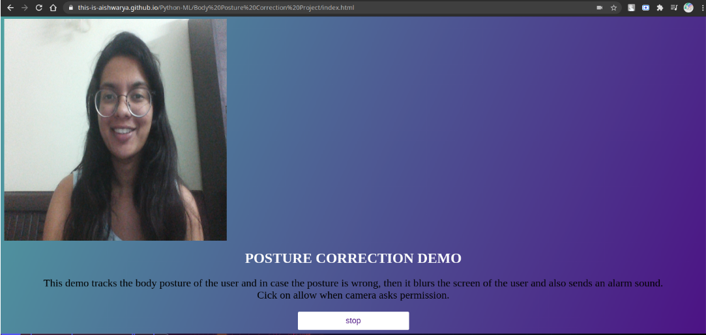
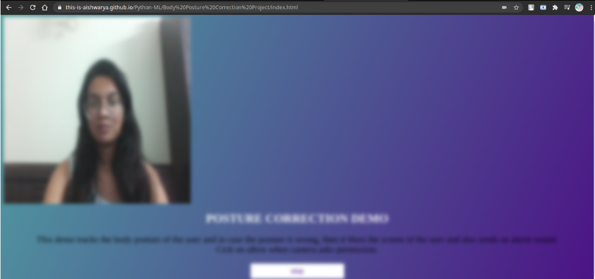

## Body Posture Correction Project

A project created using Tensorflow.JS, Posenet, ML5.JS, P5.JS which tracks the body posture of the user and in case the posture is wrong, then it blurs the screen of the user and also sends an alarm sound.
On leaning backwards or sidewards, the screen blurs out and an alarm is set off.

##### Implementation Link -
https://this-is-aishwarya.github.io/Python-ML/Body%20Posture%20Correction%20Project/index.html

##### Steps to run the project
- Allow camera access to the web pagee.
- Click on 'Start'

##### Tech Stack

- **Languages**:
    - HTML
    - CSS
    - Javascript
    
- **Modules**: 
    - Posenet: PoseNet is a vision model that can be used to estimate the pose of a person in an image or video.
    
- **Libraries**: 
    - TensorFlow
    - ML5.JS: The library provides access to machine learning algorithms and models in the browser, building on top of TensorFlow.js with no other external dependencies.
    - P5 library

##### CDN Links
https://cdnjs.cloudflare.com/ajax/libs/p5.js/0.7.3/p5.min.js
https://cdnjs.cloudflare.com/ajax/libs/p5.js/0.7.3/addons/p5.dom.min.js
https://unpkg.com/ml5@0.2.3/dist/ml5.min.js

#### Project Demo

When the user is still and maintaining the correct posture, the camera shows a clear image

When the user leans back or move sideways, the screen blurs completely and sends an alert sound. This alerts the user regarding incorrect posture. The screen becomes normal only when the user sits in the correct posture.

