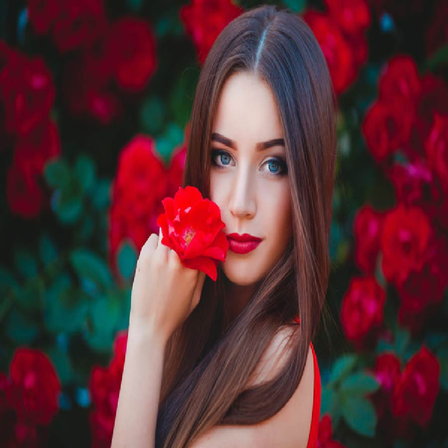

# Applying "Colorful-Sketch Filter" on an image.

Converting an image into a colorful-sketch filtered image using OpenCv, Os, Matplotlib and Numpy.

## Steps:
* Firstly imported the required libraries which are Numpy, Cv2, Matplotlib and Os.
* Taking path of the image/Original image as input using os and finally reading it using cv2 and finally getting the required colorful-filtered image.

## Methods Used
* Used Bilateral Filter
* Followed by Median Blur
* Followed by Adaptive Threshold
* And at last used Bitwise or
* Finally converted the image into colorful-sketch filter image

## Original Image

## Colorful-Sketch Filtered Image

