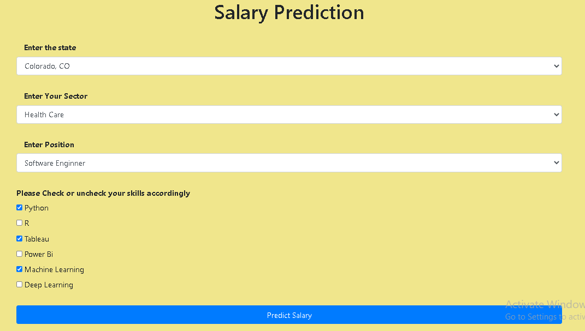
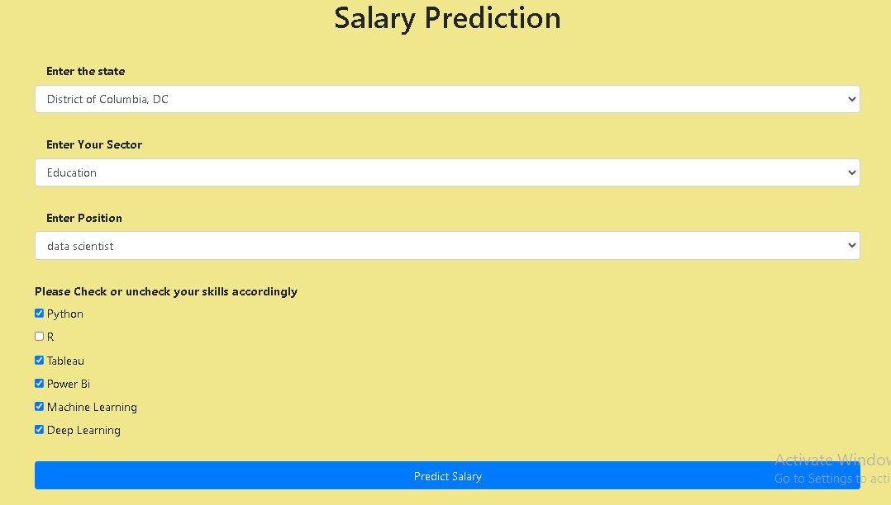
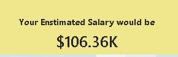

# Salary Prediction app 

## About the Data

This is a webapp which can predict Salary of a person given his skillset, his sector of interest, area of work, etc.

## Aim

The aim is of this web app is to get approximate annual salary of a person  based on his/her skillset, preferred sector and area of the work.

## Module Used for NLP

Random Forest Algorithm is used for prediction of salary.
Flask is used to getting information from user and predicting it using the above model

## Steps Performed under NLP

1. Select the approproate fields from the data.
2. Train model on the data
3. Do some Hyperparameter tuning
4. Save th model
5. Deply using flask frame-work.

## Output:

Input 1\
\
Output 1\
\
Input 2\
\
Output 2\
\
