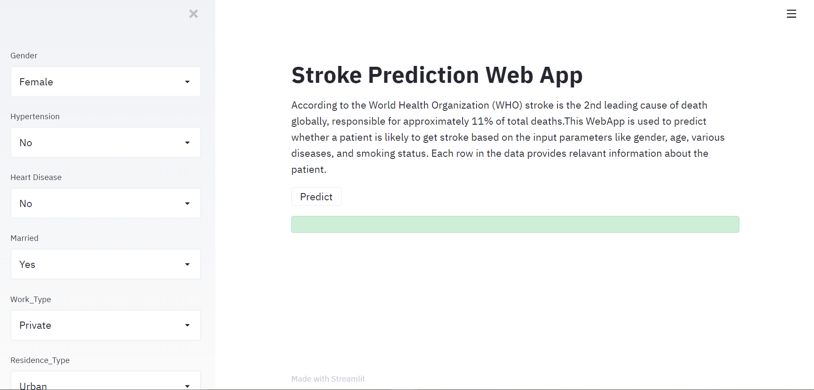
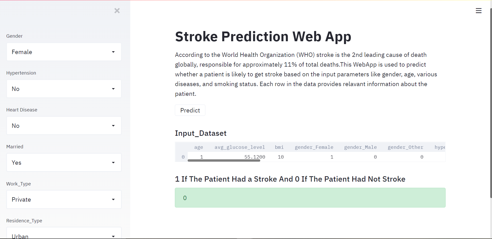

# Stroke Prediction WebApp-with-Streamlit-and-Python 

## Streamlit is an open-source app framework for Machine Learning and Data Science projects, Which helps you to view your projects in the Web Application.

## According to the World Health Organization (WHO) stroke is the 2nd leading cause of death globally, responsible for approximately 11% of total deaths.
## This Web App  is used to predict whether a patient is likely to get stroke based on the input parameters like gender, age, various diseases, and smoking status. Each row in the data provides relavant information about the patient.

 
 

## To run in your local system, install the required packages from requirements.txt file.
